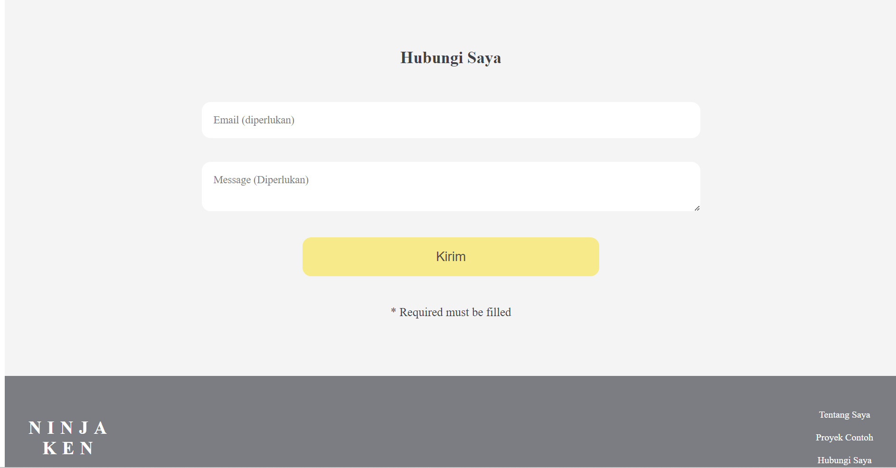

## Running locally

```bash
git clone https://github.com/LewinsHp/Lesson-Frontend-Course.git
cd latihan-html-css
localhost/latihan-html-css
```


## Built Using

Tools i'm using to build this project
- [Html](https://www.w3schools.com/html/)
- [Css](https://www.w3schools.com/css/)

## Version Website
<p align="center">
  
</p>
<p align="center">
  
</p>
<p align="center">
  
</p>

## Version Mobile
<p align="center">
  
  
</p>
## Credits

+1 ♥ to my inspiration during building this project

- [Progate](https://progate.com/)

## License

Licensed under [MIT License, Copyright (c) 2023 Lewin](./LICENSE)
